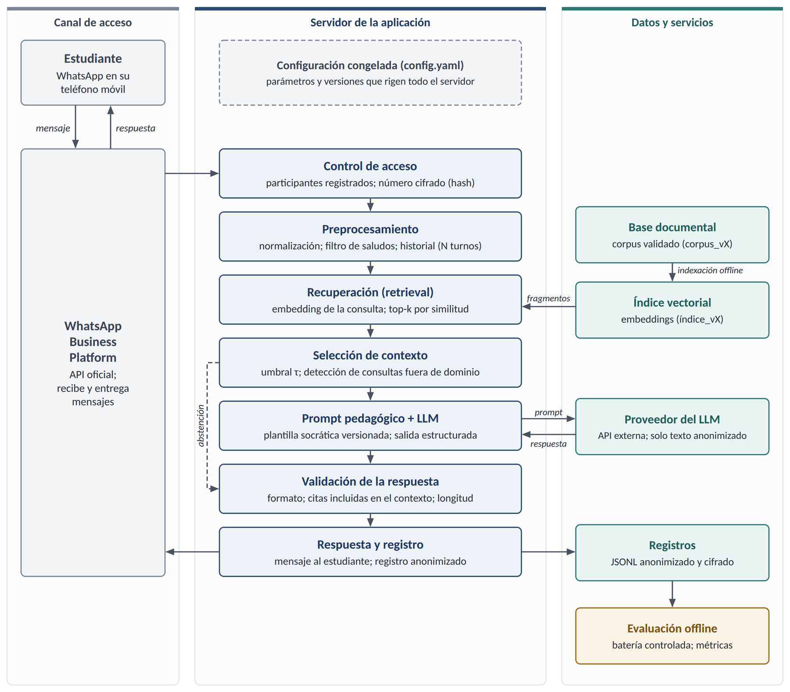
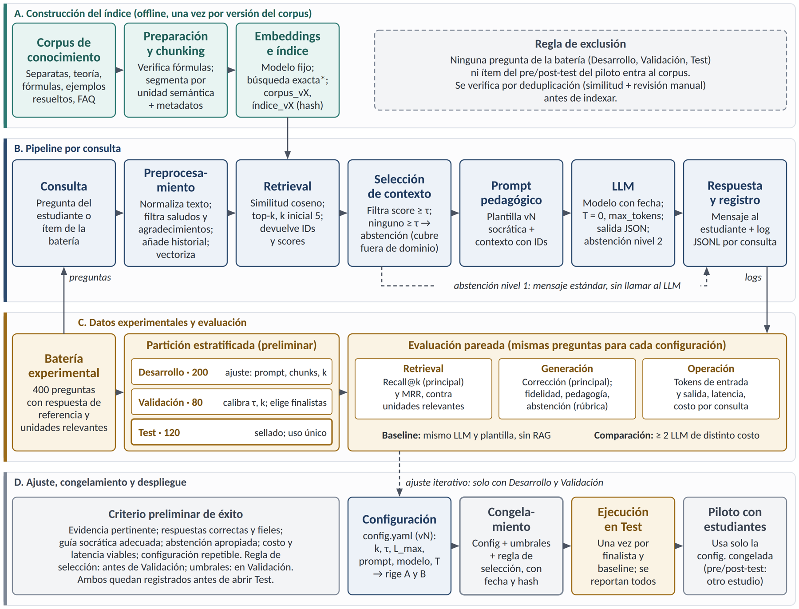

# Chatbot educativo de cinemática basado en IA generativa y RAG

**Desarrollo y evaluación de un chatbot educativo basado en IA generativa y RAG para reforzar el aprendizaje de cinemática preuniversitaria en una academia de Chachapoyas**

| | |
|---|---|
| **Autor** | Elmer Dante Rojas Zuta |
| **Programa** | Maestría en Inteligencia Artificial — Universidad Nacional de Ingeniería (UNI) |
| **Curso** | Proyecto de Investigación II |
| **Docente** | Glen Dario Rodriguez Rafael |
| **Tipo de tesis** | LLM + RAG (Retrieval-Augmented Generation) |
| **Estado** | Fase de diseño: proyecto de investigación (capítulos I–IV) y diseño reproducible del flujo experimental. Implementación pendiente. |

---

## 1. Descripción

Este repositorio contiene el trabajo de tesis sobre un **tutor de física por WhatsApp** que, antes de responder, recupera información de una base de conocimiento de cinemática validada por docentes y genera una respuesta pedagógica con **enfoque socrático**: guía al estudiante paso a paso en lugar de entregarle solo el resultado. Cuando no encuentra evidencia suficiente, el sistema **se abstiene** y deriva la consulta al docente.

**Dominio:** cinemática preuniversitaria — MRU, MRUV, caída libre, tiro parabólico y movimiento circular.

El sistema es una herramienta de **refuerzo extracurricular**; no reemplaza al docente. No se entrena ningún modelo fundacional: se utiliza un LLM accesible por API, integrado con una arquitectura RAG.

## 2. Preguntas de investigación

- **Problema general:** ¿En qué medida el uso de un chatbot educativo basado en IA generativa y RAG, accesible a través de WhatsApp, mejora el rendimiento en cinemática de los estudiantes preuniversitarios, en comparación con el refuerzo académico convencional?
- **Pregunta técnica:** ¿En qué medida la recuperación de información (RAG) mejora la corrección y la fidelidad de las respuestas respecto del mismo LLM sin recuperación?

## 3. Arquitectura del sistema



Una consulta recorre el siguiente flujo:

```
Consulta (WhatsApp) → control de acceso → preprocesamiento → retrieval (top-k)
→ selección de contexto (umbral τ / abstención) → prompt pedagógico → LLM
→ validación de la respuesta → respuesta al estudiante + registro
```

## 4. Diseño experimental

La evaluación tiene dos componentes:

1. **Evaluación técnica (offline):** un banco controlado de 400 preguntas de cinemática, dividido en desarrollo (200), validación (80) y evaluación final (120, sellada). Se compara el sistema **con RAG** frente al **mismo LLM sin RAG** (línea base), y se comparan modelos de distinto costo.
2. **Estudio educativo:** diseño cuasi-experimental con dos aulas (grupo experimental y grupo de comparación), pre-test y post-test, analizado con ANCOVA.



### Métricas principales

| Dimensión | Métrica principal | Métricas complementarias |
|---|---|---|
| Recuperación | Recall@k | Precision@k, MRR, tasa de recuperación fallida |
| Generación | Corrección | Fidelidad al contexto, afirmaciones no sustentadas, calidad socrática, abstención |
| Operación | — | Latencia p50/p95, tokens, costo por consulta, disponibilidad |

### Principios de reproducibilidad

- Toda la configuración vive en un único archivo versionado (`config/`), identificado por su hash.
- El corpus, el índice, los embeddings y la plantilla del prompt se versionan.
- Cada consulta genera un registro trazable (`evaluation/log_schema.json`).
- El conjunto de evaluación final se ejecuta **una sola vez**, con la configuración y los umbrales congelados de antemano.
- Los LLM no garantizan respuestas idénticas entre ejecuciones: se reproduce la **configuración** y la variabilidad se mide repitiendo un subconjunto fijo de preguntas.

## 5. Estructura del repositorio

```
chatbot-cinematica-rag/
├── README.md               ← este archivo
├── .gitignore              ← excluye datos sensibles, credenciales y resultados pesados
├── .env.example            ← plantilla de variables de entorno (sin claves reales)
├── requirements.txt        ← dependencias previstas (preliminar)
├── docs/                   ← documentación de la tesis
│   ├── entregables/        ← entregables del curso (diseño del flujo experimental)
│   └── figuras/            ← diagramas: arquitectura, flujo experimental, modelo conceptual
├── config/                 ← configuración versionada del sistema (config.yaml)
├── data/                   ← datos (NO se publican; ver data/README.md)
│   ├── corpus/             ← base de conocimiento validada (materiales del curso)
│   └── bateria/            ← banco de 400 preguntas y su partición
├── prompts/                ← plantillas versionadas del prompt pedagógico
├── src/                    ← código fuente del chatbot (en desarrollo)
├── evaluation/             ← protocolo, métricas y esquema de registro
├── experiments/            ← ejecuciones registradas (run_id)
├── notebooks/              ← análisis exploratorios y estadísticos
└── results/                ← resultados agregados y tablas para la tesis
```

Cada carpeta contiene su propio `README.md` con su propósito y su contenido previsto.

## 6. Política de datos y ética

- **Este repositorio no contiene datos personales de estudiantes.** Los registros de interacción se anonimizan y se almacenan fuera del repositorio.
- **Los materiales del curso** (separatas, ejemplos resueltos) no se publican por derechos de autor; solo se documenta su estructura.
- **El banco de preguntas no se publica**, para evitar la contaminación de la evaluación (si las preguntas fueran públicas, podrían terminar en datos de entrenamiento de futuros modelos).
- Las claves de API se gestionan con variables de entorno (`.env`), nunca en el código.
- El tratamiento de datos se ajusta a la Ley N.° 29733, Ley de Protección de Datos Personales (Perú).

## 7. Hoja de ruta

- [x] Proyecto de investigación (capítulos I–IV)
- [x] Diseño reproducible del flujo experimental
- [x] Estructura del repositorio
- [ ] Diagnóstico inicial (prueba por subtemas y encuesta) — ciclo 2026-II
- [ ] Construcción y validación de la base de conocimiento (corpus_v1)
- [ ] Construcción del banco de 400 preguntas y su partición
- [ ] Implementación del prototipo (RAG + LLM + WhatsApp)
- [ ] Evaluación técnica (desarrollo → validación → congelamiento → evaluación final)
- [ ] Validación de instrumentos (pre-test, post-test, encuestas)
- [ ] Intervención con estudiantes — ciclo 2027-I
- [ ] Análisis de resultados e informe final

## 8. Cómo citar

> Rojas Zuta, E. D. (2026). *Desarrollo y evaluación de un chatbot educativo basado en IA generativa y RAG para reforzar el aprendizaje de cinemática preuniversitaria en una academia de Chachapoyas* [Proyecto de tesis de maestría]. Universidad Nacional de Ingeniería.
